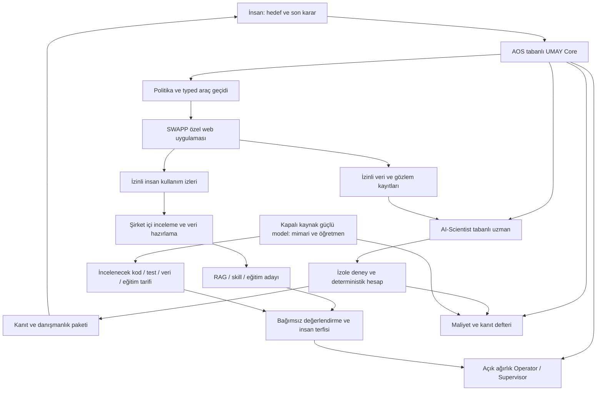

# UMAY OS — Mimari ve sahiplik

Durum: hedef mimari · Sürüm: 0.2.0 · [Paket dizini](README.md).

## 1. Çalışan sistemin sınırı

Referans kurulum, bir Linux sunucusunda Core, yerel model servisleri, kuyruk/registry, özel kanıt deposu ve izole deney alanıdır. SWAPP'ın geliştirme örneği aynı makinede veya ayrı şirket sunucusunda çalışabilir. GUI için ayrı tarayıcı profili/oturumu kullanılır. Büyük bir orkestrasyon platformu ilk dilimin önkoşulu değildir; süreç yöneticisi ve sınırlandırılmış container'lar yeterli olup olmadığı kapasite testinde belirlenir.



Öğretmen hattındaki girdiler varsayılan olarak sentetik veya paylaşımı onaylıdır. Şirket içi kayıtlar öğretmene otomatik aktarılmaz. Şemadaki her sonuç ve sürüm ilişkilendirilebilir kimlik taşır; oklar izin sınırlarını kaldırmaz.

## 2. Bileşen sorumlulukları

| Bileşen | Yapacağı iş | Yapmayacağı varsayım |
| --- | --- | --- |
| UMAY Core / AOS türevi | İş yaşam döngüsü, kimlik/politika, typed tool gateway, iptal, GUI lease, kaynak bütçesi | Model çıktısından yeni yetki türetmez |
| Operator / Core System 1 | Taze gözleme göre izinli seçeneklerden hızlı eylem seçimi | Serbest shell veya mühendislik açıklaması üretme zorunluluğu yok |
| Supervisor / Core System 2 | Plan, kaynaklı açıklama, belirsizlik ve toparlanma | Araç geçidini veya insan kararını atlamaz |
| SWAPP Application Pack | Rol/tenant, UI profili, gözlem, parametreli akışlar, veri eşleme ve sonuç doğrulama | Henüz bilinmeyen endpoint veya selector uydurmaz |
| Scientist / AI-Scientist türevi | Deney önerme, çalıştırma, ölçme, kıyas, kaynaklı sonuç | Anomali skorunu arıza teşhisine veya kontrol komutuna dönüştürmez |
| Bilgi ve öğrenme hattı | Corpus/skill/dataset hazırlama, offline eğitim, evaluation ve terfi | Üretimde sessiz güncelleme yapmaz |
| Teacher & Build Lab | Mimari, kod/test üretimi, incelenecek öğretmen etiketi, eğitim tarifi ve hata incelemesi | Öğretmen cevabını bağımsız doğruluk kaynağı saymaz |
| Maliyet defteri | Geliştirme, provider, GPU, depolama ve insan emeği kullanımını ilişkilendirme | Eksik ölçümü sıfır veya tahmini faturalanmış maliyet saymaz |

**Eylemci model değildir.** Eylemci bir yetenek, araç yetkisi, girdi/çıktı sözleşmesi ve yaşam döngüsüdür. Model bu görevi yerine getirmek için kullandığı sürümlü bileşendir. Bir model birden fazla rolü destekleyebilir; aynı modelin paylaşımı ayrı eşzamanlılık ve bağlam izolasyonu testi gerektirir.

AI-Scientist kendi araştırma planını/Director döngüsünü korur. İçeride kullandığı S1/S2 etiketleri Core'un finite-choice Operator sözleşmesiyle aynı kabul edilmez. İki sistem `job_id`, `experiment_id`, veri ve sonuç sözleşmeleriyle bağlanır. Core uygulama yürütmesinin, Scientist deneyin sahibidir; iki bağımsız GUI yöneticisi açılmaz.

## 3. Mevcut tabandan kontrollü geliştirme

[Pinli kaynaklar](README.md) başlangıçtır. İlk iş mevcut S1/S2, registry, bilgi/skill, eğitim adayı, sandbox ve GPU paylaşım yollarını inceleyip UMAY gereksinimine karşı fark tablosu oluşturmaktır. Aynı işi yapan ikinci scheduler, registry veya bilimsel harness yalnız yeni isim vermek amacıyla yazılmaz.

Özel çalışma alanı için önerilen yerleşim:

```text
components/aos-core/          pinli AOS türevi ve küçük, izlenebilir patch'ler
components/ai-scientist/      pinli Scientist türevi
integrations/swapp/           özel uygulama profili ve veri eşleyiciler
packages/contracts/          sürümlü UMAY sınırları
packages/policy/             sunucu tarafı yetki ve veri politikası
learning/                    RAG, skill, dataset, recipe ve evaluation
deployment/linux/            tekrarlanabilir süreç/container profili
tests/acceptance/             sentetik ve izinli bağımsız kabul vakaları
project/                     kararlar, gerçek durum, maliyet ve devir kaydı
```

Bu yollar öneridir; bu public site deposunda runtime oluşturulması talimatı değildir. Submodule, vendor snapshot veya ayrı paket kararı kaynak/CI envanterinden sonra kaydedilir. Her türev için upstream URL/SHA, patch listesi, lockfile, hak envanteri, bakım sahibi ve kabul raporu tutulur. Upstream değişiklikleri gözden geçirilir; `latest` etiketi üretimi kendiliğinden güncellemez.

## 4. Özel alan ve veri sahipliği

| Varlık | Önerilen saklama ve erişim |
| --- | --- |
| Public manifesto ve genel mimari | Bu depo; genel ve sentetik içerik |
| SWAPP frontend/backend | Şirketin özel kaynak deposu; ayrı teslim/erişim |
| Ham kullanım izi, ekran, kullanıcı iş akışı, dijital ikiz verisi | Şirketin izinli, sınırlı erişimli deposu; amaca göre saklama süresi |
| İncelenmiş corpus, vektör indeks, skill, dataset | Şirket özel registry; kaynak/tenant/rol/izin sürümü korunur |
| Şirkete uyarlanmış LoRA ve değerlendirme artifact'leri | Şirket özel model deposu; temel model hakkı ve adapter bağı ayrı kaydedilir |
| Temel açık ağırlık model | İlgili modelin lisans/kullanım koşulları; şirket verisinden türeyen artifact ile aynı mülkiyet varsayılmaz |
| Kapalı model öğretmen çağrısı | Onaylı provider politikası, ölçülen model sürümü, izinli veri sınıfı ve maliyet kaydı |

Vektörler anonim veya zararsız kabul edilmez. Adapter da şirket bilgisi ve davranışı taşıyabilecek özel artifact'tir. Ayrı şirketlerin veri, cache, corpus ve adapter'ları ortak tenant bağlamına alınmaz. Dış provider'a kaynak kodu ya da gerçek iz gönderimi, belirli veri sınıfı için tanımlı şirket politikası yoksa kapalı kalır; diğer sentetik geliştirme işleri devam eder.

## 5. SWAPP'ı iyi bilmek nasıl ölçülür?

“Uygulamayı bilir” bir pazarlama iddiası olarak bırakılmaz. Kabul kataloğu şu akışları kapsar: izinli giriş ve rol/tenant doğrulama; doğru dijital ikiz/varlık seçimi; sinyal, birim, zaman dilimi ve pencere seçimi; sayfalama ve filtreler; izinli veri okuma/export; boş/yükleniyor/hata durumları; oturum sonu; sürüm değişiminde güvenli durma; sonucun bağımsız veri oracle'ıyla karşılaştırılması.

Gerçek depolar teslim edildiğinde arayüz ve veri şeması koddan çıkarılır; uygulanmış API yolu varsa belgelenir. O zamana kadar mock arayüz sadece sözleşme fizibilitesidir. API üzerinden veri almak GUI kullanma kabulünün yerine geçmez. DOM/erişilebilirlik gözlemi önceliklidir; vision ayrı yetenektir. Ekrandaki grafikten kesin zaman serisi uydurulmaz; izinli tablo/export yoksa bilgi eksikliği görünür tutulur.

SWAPP eylemleri tenant, oturum, uygulama build'i, skill sürümü, önkoşul, postcondition ve veri kapsamına bağlıdır. Var olmayan cihaz/alan, stale state veya yanlış birimde çalışmak başarı sayılmaz. İlk kapsam gezinme, okuma ve izinli export'tur; uygulamadaki kontrol niteliğindeki butonlar da kapsam dışıdır.

İleriki aşamada, teslim edilen uygulama destekliyorsa SWAPP olay/plan taslağı veya inceleme kaydı oluşturma gibi uygulama içi kayıt işlemleri ayrı capability olabilir. Bunlar belirli rol/alan kapsamı, işlem öncesi insan onayı, idempotency, bağımsız postcondition ve mümkünse undo ile kabul edilir. Uygulama kaydı oluşturma OT setpoint/start-stop veya alarm kontrolüyle aynı yetki değildir; kontrol sınırı korunur.

## 6. Linux, sandbox ve eşzamanlılık

İlk profilde Linux sürümü/kernel, CPU, RAM, GPU/VRAM, sürücü, model engine, disk ve GPU paylaşım davranışı ölçülüp kaydedilir. Asgari donanım ölçmeden vaat edilmez. CPU ile sözleşme ve küçük deney testleri mümkün olabilir; model/eğitim kapasite kabulü kullanılan gerçek cihazda yapılır.

Core, Scientist ve öğretmen ayrı süreç/yetki alanlarında çalışır. Deney sandbox'ı salt okunur girdi, işe özel yazılabilir çıktı, ağ varsayılanı kapalı, süre/CPU/RAM/GPU/disk kotası ve süreç grubu iptali taşır. Üretilen kod host shell, Docker socket, kimlik bilgisi veya genel ağ erişimini miras almaz. Timeout ve OOM terminal duruma, açıklamaya ve maliyet kaydına dönüşür.

Her GUI oturumunun tek etkin sahibi vardır: `session_id + lease_id + fencing_token + expires_at`. Kaybedilmiş/eski lease ile araç çağrısı reddedilir. İnsan “devral” dediğinde yeni otomasyon çağrıları durur, eski lease geçersizleşir; devam ancak yeni sahiplik ve taze durumla olur. Paralel işler ayrı izole oturumlar veya sıraya alma kullanır. Tek fiziksel GPU paylaşımı kaynak ölçümü ve lease ile yürütülür; bellek dolması kapalı provider'a sessiz kaçış başlatmaz.

Gözlenen web içeriği, kullanım izi, doküman ve teacher çıktısı güvensiz girdi olarak işlenir. İçeriğin “bunu çalıştır” demesi yeni yetki değildir. Politika kontrolleri istemcide/promptta kalmaz; sunucu tarafı araç, retrieval ve provider sınırlarında uygulanır.

## 7. İşletim ve sürüm geçişi

İş sürümleri başlangıçta pinlenir: Core/Scientist, SWAPP build/skill, model/adapter, corpus, policy ve evaluation. Yeni sürüm önce aday ortamında sınanır; aktif sürüm pointer'ı insan terfisiyle atomik değişir. Çalışan işler kendi pinleriyle tamamlanır veya açıkça iptal edilir. Model/adapter/embedding değişimi ilgili indeks ve checkpoint uyumluluğunu yeniden değerlendirir.

İzleme; başarı/başarısızlık, doğru çekimserlik, gecikme ve kuyruk, kaynak kullanımı, drift, izin ihlali denemesi, öğretmen bağımlılığı ve maliyet kapsamını birlikte gösterir. Öğretmen kapalı olduğunda yerel kabul edilmiş akışların çalışabilmesi ayrı testtir. Kanıt depoları için restore provası ve seçili sürüme rollback testi yapılmadan “işletime hazır” denmez.
